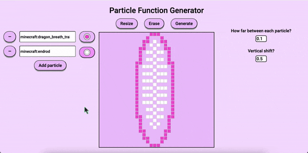

# Particle Function Generator (Bedrock)
This program lets you convert a drawing into a function of Minecraft particle commands for Bedrock Edition. For every square you color, a particle command will be created.

After you've finished drawing, hit generate and click the output box to copy the function!